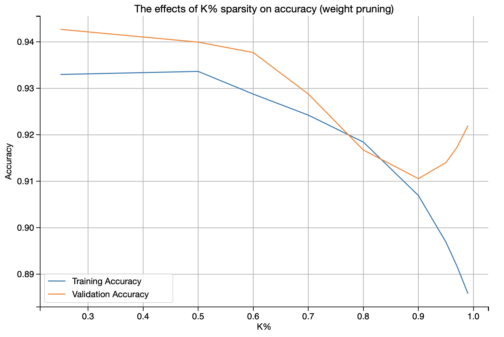
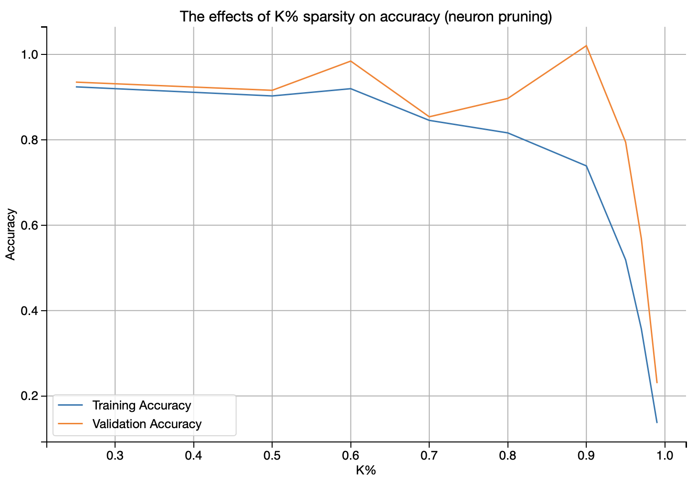
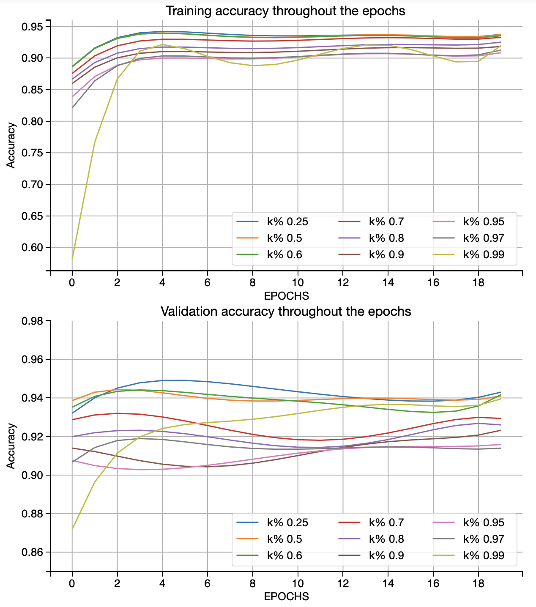
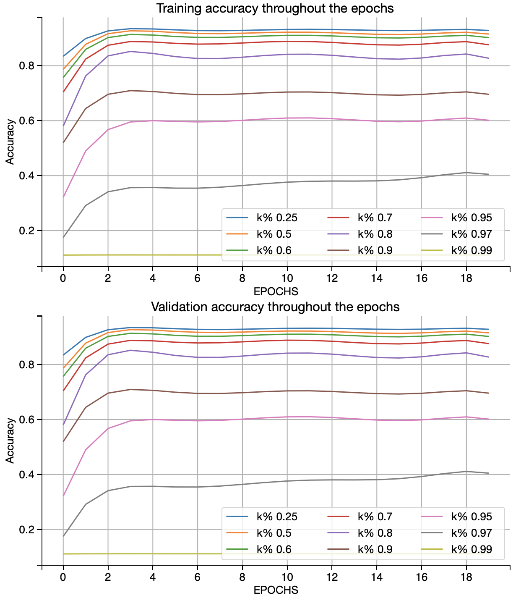
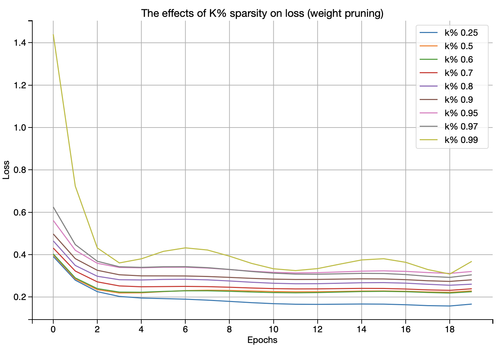
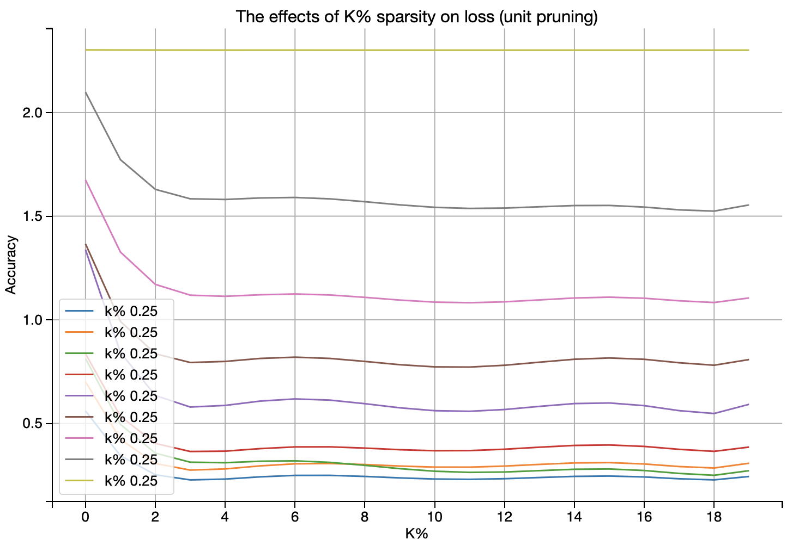

# Optimal brain damage

How many neurons can we remove from a neural net before performance suffers?

To run this notebook, simply load this notebook in your Jupyter environment and run all cells.

- Pruning is one of the methods for inference to efficiently produce models smaller in size, more memory-efficient, more power-efficient and faster at inference with minimal loss in accuracy, other such techniques being weight sharing and quantization.
- Although weight pruning can be a rather computationally expensive process compared to unit pruning, it is evident from the accuracy curves that overall weight pruning performs better than unit pruning.
- Since the inference time remains approximately the same for both pruning methods, it is possible to sacrifice training time to use weight pruning for a smaller, more efficient network.
- Sparse models are easier to compress, and sparsity allows us to store the weights much more efficiently. However, as we increase the sparsity and delete more of the network, the task performance will progressively degrade.

### Weight-pruning accuracy as k% changes:

### Unit-pruning accuracy as k% changes:

### As is evident from the graphs above, the amount of degredation of accuracy when weight pruning is much less than unit pruning

- Dropping a neuron affects the model performance greatly as we are effectively stopping the flow of information from flowing through and being processed. This is in contrast to weight pruning where setting a weight to 0 does not lead to as great of a loss as we are not dropping neurons -- so the values of the neurons stay the same even if we are setting weights to 0.

### Accuracy degradation across the epochs when weight-pruning:

### Accuracy degradation across the epochs when unit-pruning:

### It is evident that although weight-pruning took a long time (approximately 1.5 hours for 20 epochs on one Titan XP Graphics card), the accuracies are higher than the unit-pruning accuracies. 

## Final thoughts
As a metric, accuracy only gives us one side of the many-sided die that is classification. It is important to also look at the degradation of the loss function for weight-pruning and unit-pruning to get a picture that is a little more hollistic. In this exercise, we used the categorical cross entropy loss function. 

### The weight pruning loss degredation

### The unit pruning loss degredation

It is clear from the above graphs that the degredation of the unit pruning method is far harsher than the weight pruning, therefore we should ideally aim for weight pruning even though it may be more computationally intensive. 

